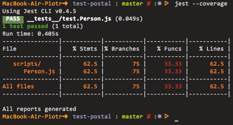

# test-postal

:ledger: Test application building with `postal.js`.

## Start

```
npm install -g jest-cli
npm install
npm test
```

## Coverage



## Authors

 - [piecioshka](http://twitter.com/piecioshka)
